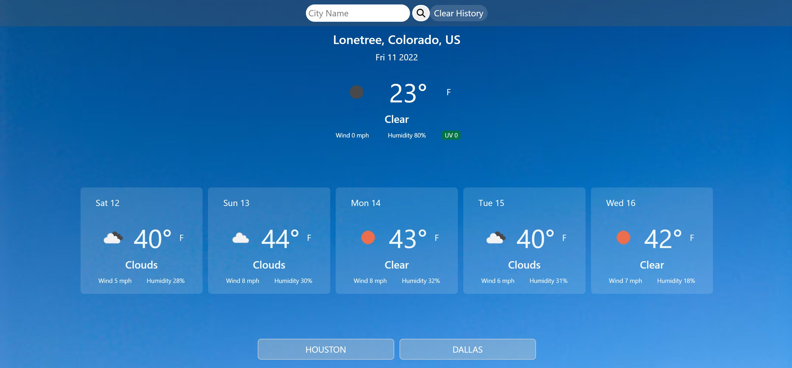

# Weather Dashboard
The application is intended to show daily and future weather forecast based on user input.

## 
---------------------------
At the top of the page search for the city you want to view weather for and click the magnifier. The application should populate with weather information for the city you entered. At the bottom, you should also be able to see the city. If you want to see the weather for another city, search for the new city and the application will display the weather for the new city and add the new city to the bottom. Now you can switch between cities to keep an eye on multiple cities.

## Links 
----------------------------

[GitHub Pages](https://ettad.github.io/weather-dashboard/)

[GitHub Repo](https://github.com/ettad/weather-dashboard)

## Screenshots/Images
-----------------------------

